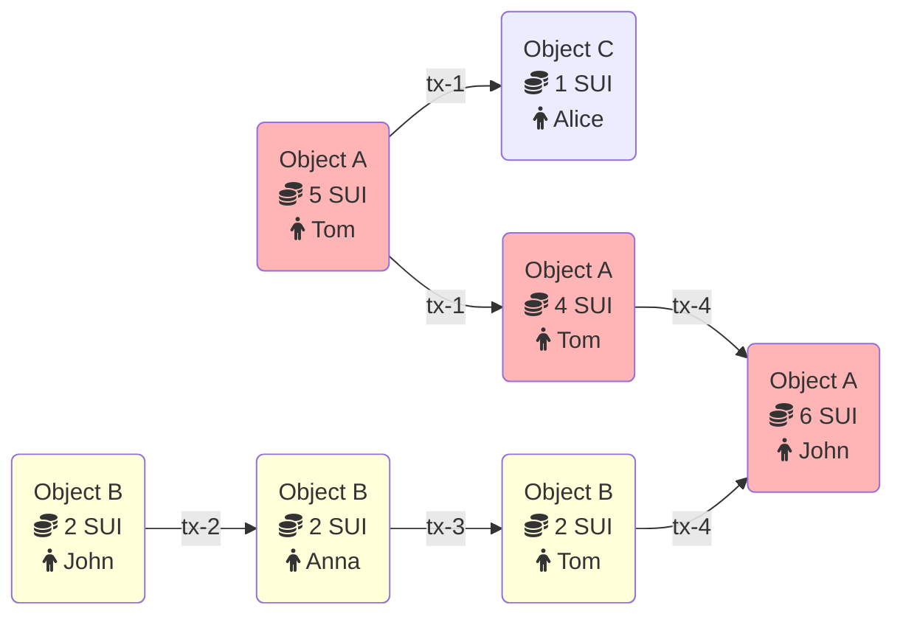

Sui 데이터베이스에 대한 모든 업데이트는 transaction을 통해 발생한다. 이 항목은 Sui가 지원하는 transaction 유형을 설명하고 그 실행이 원장에 어떤 변화를 일으키는지 설명한다. Sui에는 오직 두 종류의 transaction만 존재한다:

- Programmable transaction blocks는 네트워크에서 누구나 제출할 수 있다. 이러한 transaction에 대한 정보는 [Programmable Transaction Blocks](./transactions/prog-txn-blocks.mdx)을 참조한다.
- System transactions는 오직 validator만 직접 제출할 수 있으며 네트워크가 동작하도록 유지하는 역할(epochs 변경, checkpoints 시작 등)을 담당한다.

## Transaction metadata

모든 Sui transaction에는 다음과 같은 공통 metadata가 있다:

- **Sender address:** Transaction을 보내는 사용자의 [address](guides/developer/getting-started/get-address.mdx)이다.
- **Gas input:** Transaction의 실행과 저장 비용을 지불하는 데 사용될 object를 가리키는 object reference이다. 해당 object는 사용자 소유이어야 하고 `sui::coin::Coin<SUI>` 타입(즉, Sui 네이티브 통화)이어야 한다.
- **Gas price:** Transaction이 가스 단위당 지불할 네이티브 토큰 수를 지정하는 부호 없는 정수이다. 가스 가격은 항상 0이 아니어야 한다.
- **Maximum gas budget:** Transaction을 실행하면서 소모될 수 있는 가스 단위의 최대치이다. 이 예산을 초과하면 transaction 실행은 중단되고 가스 입력 object에서 차감되는 것 외에는 어떤 효과도 발생하지 않는다. 따라서, 가스 입력 object는 가스 가격과 최대 가스의 곱보다 높은 값을 가져야 하며, 이 곱한 값이 해당 transaction에 대해 가스 입력 object가 차감될 수 있는 최대 금액이 된다.
- **Epoch:** Transaction이 적용되도록 의도된 Sui epoch이다.
- **Type:** call, publish, 또는 native transaction과 그 type-specific-data(아래 참조)이다.
- **Authenticator:** 서명을 검증하고 sender address에 의해 암호학적으로 커밋되는 서명과 공개 키이다.
- **Expiration:** validator가 더 이상 해당 transaction을 유효하다고 간주하지 않는 시한을 설정하는 epoch reference이다. 선택적 마감 epoch reference는 사용자가 특정 시한까지 실행 및 커밋되도록(current epoch은 expiration epoch 보다 작거나 같음) transaction을 정의하거나, 마감 시한이 지나면 결코 실행되지 않도록 정의할 수 있게 한다. 기본적으로 transaction이 실행되어야 하는 마감 시한은 없다.

## Example of a transaction flow

다음은 Sui에서 object와 transaction이 서로 어떻게 연결되는지를 보여주는 예시이다.

다음 예시에는 두 개의 object가 있다:

- Object A는 총 잔액이 5 SUI인 SUI 타입의 coin이다
- Object B는 John에게 속한 2 SUI coins를 가진 object이다

Tom은 Alice에게 1 SUI coin을 보내기로 결정한다. 이 경우 Object A가 이 transaction의 입력이며 이 object에서 1 SUI coin이 차감된다. 해당 transaction의 출력은 두 개의 object이다:

- Object A는 여전히 Tom에게 속하며 4 SUI coins를 가진다
- 새로 생성된 Object C는 이제 Alice에게 속하며 1 SUI coin을 가진다.

동시에 John은 Anna에게 2 SUI coins를 보내기로 결정한다. Object와 transaction 간의 관계가 directed acyclic graph(DAG)로 기록되어 있고 두 transaction이 서로 다른 object와 상호작용하므로, 이 transaction은 Tom이 Alice에게 coins를 보내는 transaction과 병렬로 실행된다. 이 transaction은 Object B의 소유자를 John에서 Anna로 변경하는 것만 수행한다.

2 SUI coins를 받은 뒤 Anna는 즉시 Tom에게 이를 보냈다. 이제 Tom은 6 SUI coins(Object A에서 4, Object B에서 2)를 가진다.

마지막으로 Tom은 자신의 모든 SUI coins를 John에게 보낸다. 이 transaction의 입력은 실제로 두 개의 object(Object A와 Object B)이다. Object B는 소멸되고 그 값은 Object A에 더해진다. 결과적으로 이 transaction의 출력은 값이 6 SUI인 Object A 하나뿐이다.

## Limits on transactions, objects, and data

Sui에는 최대 크기와 사용되는 object 수와 같은 transaction 및 그에 사용되는 데이터에 대한 몇 가지 제한이 있다. 이러한 제한은 Sui 리포지토리의 [`sui-protocol-config` crate](https://github.com/MystenLabs/sui/blob/main/crates/sui-protocol-config/src/lib.rs)에서 확인할 수 있다. 이 제한들은 `ProtocolConfig` struct에 정의되어 있으며 값은 `get_for_version_impl` 함수에서 설정된다.
